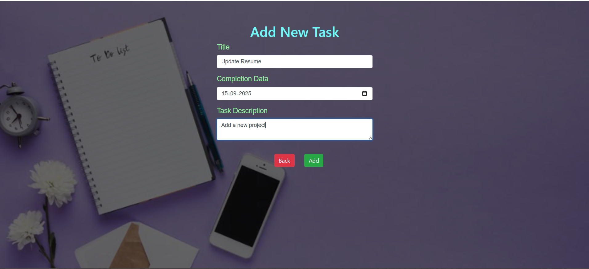

# 📝 To-Do List Web Application

A simple **To-Do List application** built using **Java, JSP, MySQL, CSS, and JavaScript**.  
This project demonstrates CRUD operations (Create, Read, Update, Delete) with user-friendly UI.

---
## Screenshots

#### Home/Index page


#### Add New Task


#### Update Task


---

## 🚀 Features
- Add new tasks  
- View all tasks  
- Edit and update tasks  
- Delete tasks  
- Persistent storage using **MySQL** database  
- Simple and responsive UI  

---

## 🛠️ Tech Stack
- **Backend:** Java (Servlets & JSP)  
- **Frontend:** JSP, CSS, JavaScript  
- **Database:** MySQL  
- **Server:** Apache Tomcat  

---

## ⚙️ Installation & Setup

### 1. Clone the repository
```bash
git clone - https://github.com/Arijitdey27/ToDo-List.git
```

### 2. Configure Database

#### 1. Open MySQL and Create a database
```bash
CREATE DATABASE todo;
```

#### 2. Update the database configuration inside the project bean (e.g., spring-servlet.xml ):
```bash
String url = "jdbc:mysql://localhost:3306/todo"; // Update port if different
String username = "your-username";  
String password = "your-password";
```

⚠️ Note:
Update port number, database path, username, and password according to your local MySQL configuration.


### 3. Deploy on Tomcat

- Copy the project folder into webapps of Apache Tomcat.
- Start the Tomcat server.
- Access the app in your browser:

```bash
http://localhost:8080/todo-list  //update poet if different
```

## 📂 Project Structure
```
todo-list/
│── ToDo-List/
│ │── src/main
│ │ │── java/com/todo
│ │ │ │── controller
│ │ │ │── dao
│ │ │ │── entities
│ │ │── webapp/WEB-INF
│ │   │── resources 
│ │   │── views 
│ │   │── spring-servlet.xml 
│ │   │── web.xml
│ │── pom.xml
│── README.md
```


## Contributing

Contributions are welcome! Feel free to open an **issue** or submit a **pull request**.

## License

This project is licensed under the MIT License. See the [LICENSE](./LICENSE) file for more details.
